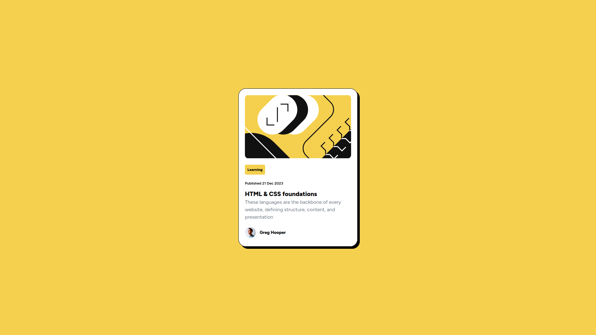

# Frontend Mentor - Blog Preview Card Solution

This is a solution to the [Blog preview card challenge on Frontend Mentor](https://www.frontendmentor.io/challenges/blog-preview-card-ckPaj01IcS). This challenge helps improve coding skills by building realistic projects.

## Table of Contents

- [Overview](#overview)
  - [The Challenge](#the-challenge)
  - [Screenshot](#screenshot)
  - [Live Demo](#live-demo)
- [Built With](#built-with)
- [Getting Started](#getting-started)
- [Author](#author)

## Overview

### The Challenge

Users should be able to:

- See hover and focus states for all interactive elements on the page.

### Screenshot



## Live Demo

- [Live Site URL](https://your-live-site-url.com)

## Built With

- React
- Tailwind CSS
- Vite

## Getting Started

1. Clone the repository:
   ```sh
   git clone https://github.com/yourusername/blog-preview-card.git
   cd blog-preview-card
   ```
2. Install dependencies:
   ```sh
   npm install
   ```
3. Run the development server:
   ```sh
   npm run dev
   ```
4. Build for production:
   ```sh
   npm run build
   ```
5. Preview production build:
   ```sh
   npm run preview
   ```

## Author

- Frontend Mentor - [@BrunoSerbai](https://www.frontendmentor.io/profile/yourusername)
- Portifolio - [@BrunoSerbai](https://brunoserbai.org)


